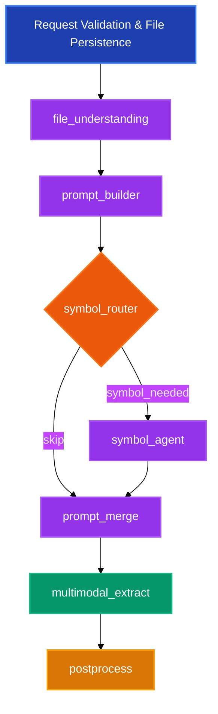

# Document Xtractor v1.2.5 - Pipeline Architecture

## Overview
Document Xtractor is a LangGraph-based multi-agent pipeline that processes industrial documents (PDF/DOCX) and returns schema-conformant structured outputs with optional symbol legend extraction.

## Pipeline Flow Diagram



## Node Descriptions

### Pre-Processing
- **Request Validation & File Persistence**: Validates input and stores files before graph execution

### Core Pipeline Nodes

#### 🔍 file_understanding
- Calls multimodal model or heuristic fallback
- Summarizes document content
- Provides hints for downstream nodes

#### 📝 prompt_builder
- Renders schema definitions into structured system prompt
- Incorporates document summary, hints, and schema-derived example output for few-shot guidance
- Creates draft prompt for extraction

#### 🔀 symbol_router (Decision Node)
- Analyzes prompt and summary for legend-related keywords
- Routes to symbol agent if symbols detected
- Otherwise skips directly to prompt merge

#### 🔣 symbol_agent
- Executes heuristic legend detection
- Populates symbol context when legends found
- Generates warnings when no legend detected

#### 🔗 prompt_merge
- Combines system prompt draft with symbol context
- Produces final extraction prompt
- Handles both symbol and non-symbol workflows

#### 🤖 multimodal_extract
- Invokes configured multimodal LLM
- Processes document with final prompt
- Returns schema-shaped data rows
- Graceful fallbacks when model unavailable

#### 📊 postprocess
- Normalizes and validates output rows
- Fills missing schema fields
- Aggregates warnings and audit metadata
- Embeds run identifiers and node timings

## Key Features

- **LangGraph pipeline** with file understanding, prompt builder, symbol router/agent, multimodal extraction, and post-processing nodes
- **Prompt-only multimodal agents** that fall back to heuristic summaries when an LLM provider is not configured
- **Schema validation & normalization** ensuring responses match user supplied field definitions
- **Schema-driven few-shot** examples derived from payload values to steer extraction outputs
- **FastAPI endpoint** `POST /v1/extract` accepting multipart uploads (`file` + JSON `payload`)
- **CLI runner** for batch extraction that reuses the same pipeline implementation
- **Audit trail** capturing node timings and graph run identifiers

## Project Layout
```
src/
  xtractor/
    api/            FastAPI application & routers
    adapters/       LLM + I/O utilities
    cli/            Command-line entry point
    config/         Settings management
    models/         Pydantic request/response models
    pipeline/       LangGraph state, nodes, and runner
    utils/          Validation helpers
tests/
  unit/             Unit tests for validators and nodes
  e2e/              Lightweight end-to-end pipeline check
```

## Getting Started

```bash
# Install dependencies (requires uv or pip)
uv sync  # or: pip install -e .[dev]

# Run the API server
uv run python main.py  # serves FastAPI on http://localhost:8000

# Or execute the CLI
uv run xtractor-cli ./samples/asset-register.pdf ./schema.json --output result.json
```

## Environment Configuration

Start by copying `.env.example` to `.env` and populate the secrets required for your deployment.

| Variable | Default | Purpose |
|----------|---------|---------|
| `DX_MM_MODEL` | `gpt-4o-mini` | Multimodal model selection |
| `DX_ENABLE_SYMBOL_AGENT` | `true` | Toggle heuristic symbol agent |
| `DX_OPENAI_API_KEY` / `OPENAI_API_KEY` | - | OpenAI authentication |
| `DX_OPENAI_BASE_URL` | - | OpenAI-compatible proxy (e.g., LiteLLM) |

**Note**: If LLM provider packages are missing, the pipeline gracefully falls back to heuristic summaries and populates warnings.

## API Contract

### Request Format
```bash
curl -X POST http://localhost:8000/v1/extract \
  -F "file=@./samples/asset-register.pdf" \
  -F 'payload={"outputFormat":"json","schema":{"key":"asset_register","fields":[{"name":"UNIQUE KKS","description":"Unique identifier"}]}}'
```

### Response Structure
```json
{
  "status": "ok",
  "concise_summary": "Document summary",
  "result": {
    "key": "asset_register",
    "rows": [{"UNIQUE KKS": "extracted_value"}]
  },
  "symbols": {"used": false, "legend": []},
  "audit": {
    "graph_run_id": "run_ab12cd34ef56",
    "nodes_path": ["file_understanding", "prompt_builder", ...]
  },
  "warnings": ["Optional warnings array"]
}
```

### Error Response Example
```json
{
  "status": "error",
  "code": "SCHEMA_INVALID",
  "message": "Field 'UNIQUE KKS' missing"
}
```

## Testing

```bash
pytest        # requires pytest to be available in the environment
```

Tests cover schema validation, symbol routing, prompt merging, and end-to-end pipeline invocation exercising heuristic fallbacks.

## Technical Notes

- **Request validation and file persistence** occur prior to graph execution; the graph starts at the file understanding stage
- **Temporary files** are stored under `./.tmp` (created on demand)
- **OpenAI integration** requires installing `langchain-openai` and setting API key
- **Symbol extraction** currently uses heuristic methods; real symbol tooling can be integrated by extending `symbol_agent.py`
- **Graceful degradation** when LLM providers are unavailable, with heuristic fallbacks and warning generation

## Containerization

Build and run the FastAPI service using the provided `Dockerfile`:

```bash
docker build -t simplify-xtractor .
docker run --rm -p 8808:8808 --env-file .env simplify-xtractor
```

The container image installs dependencies via `uv` and serves the API using `uvicorn` on port 8808.
